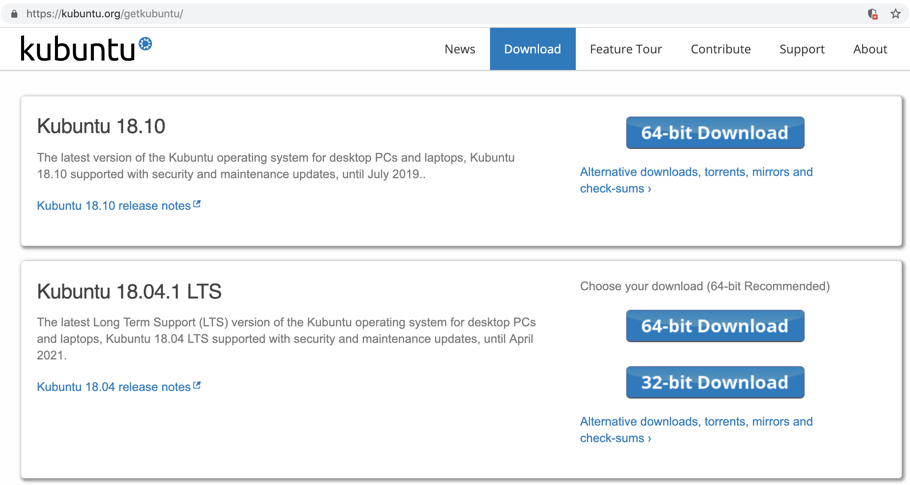
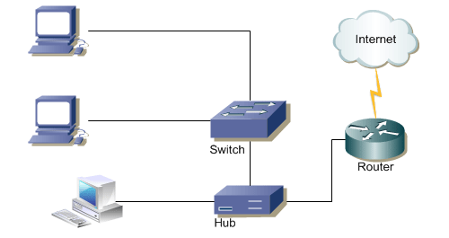
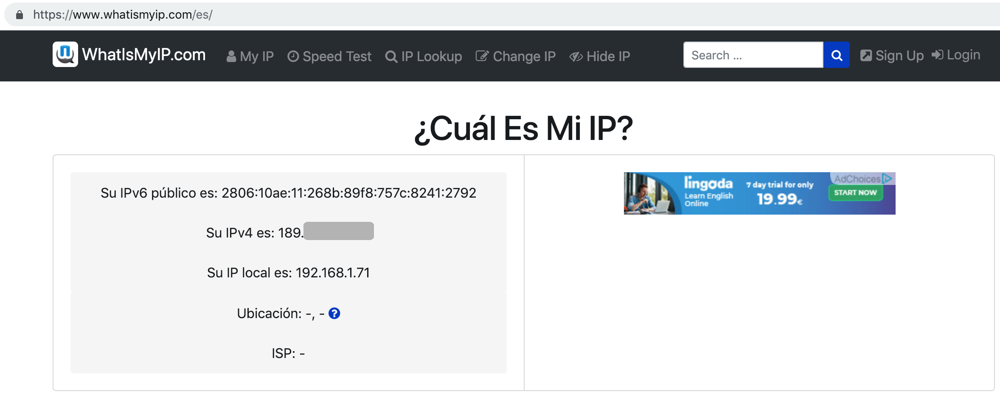
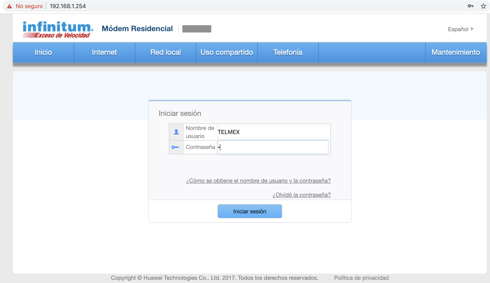
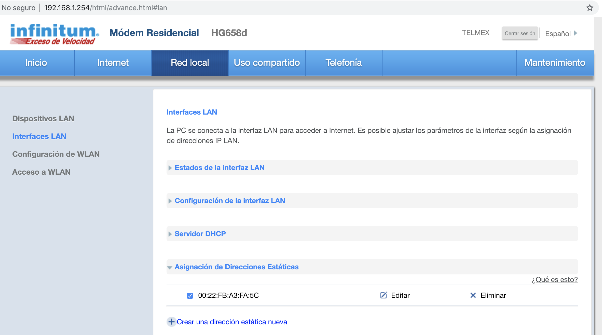
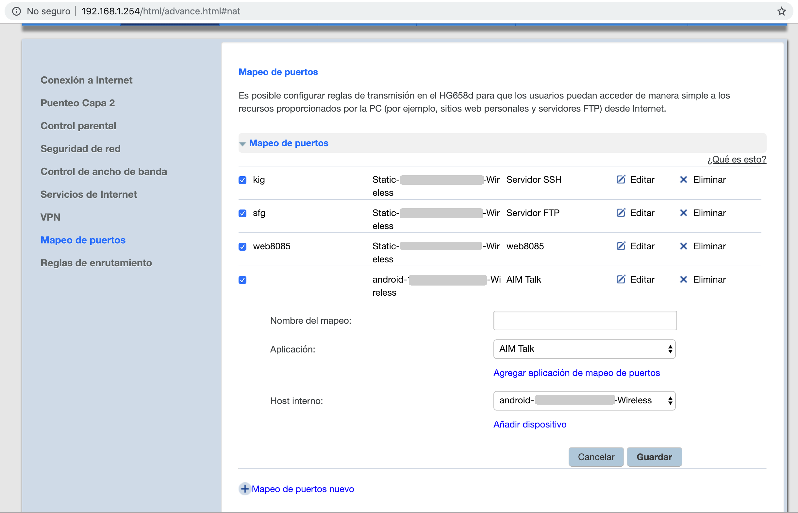
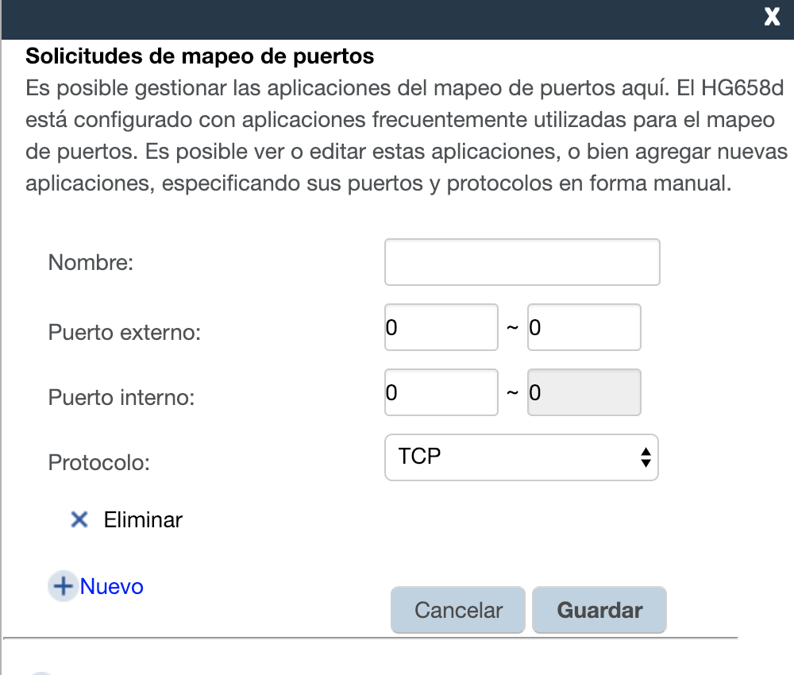

Montar un Servidor Internet de Casa
===

Si tenemos una PC vieja podemos usarla como un servidor FTP para guardar contenido o un servidor SSH, con nuestro internet casero.


## 1. Instalar un sistema operativo

En nuestro caso vamos a instalar una versión de Linux deribada de Debian y similar a Ubuntu, <a href="https://kubuntu.org/">Kubuntu</a>.

Instalamos Kubuntu debido a la simplicidad, que aún así no deja de ser complicado para usuarios nuevo. También por el escritorio que maneja, KDE es muy intuitivo.

En la sección de <a href="">descargas</a> podremos ver algo como:

<p align="center">
	
</p>

1. La primera opción tiene las últimas actualizaciones.
2. La segunda opción la LTS (Long Term Support) una versión que recibe soporte por amplio tiempo.

Recomiendo la segunda opción.

##### 1.1 USB Booteable

Hay mucho programas para hacer nuestra USB booteable, recomiendo <a href="https://rufus.ie/es_ES.html">RUFUS</a> 

Hay que Bootear desde la PC. En nuestro caso tenemos una VAIO y lanzamos la BIOS con F2 -> Nos vamos al menú BOOT -> Ponemos <i>External Device Boot</i> como <i>Enable</i> -> Nos movemos con las teclas F5 y F6 -> Ponemos como prioridad <i>External Device</i> -> guardamos con F10.

## 2. Configurar el Router

<p align="center">
	
</p>

Bueno pues tenemos que recordar que Internet es una Red de Redes. En nuestra casa se pude decir que tenemos una Red LAN (Red de Area Local) y nuestros dispositivos salen a la red a través de la IP del Router, esto es muy benéfico debído a que así se puede ahorrar direcciones IP y podemos seguir usando el estándar IPv4 (ya está IPv6 que contiene un rango mayor de direcciones IP). Esto nos permite usar direcciones privadas para cada uno de nuestros dispositivos tipo: 192.168.1.1 ... 192.168.1.254 en todos los hogares y usar otra dirección IP Pública para salir a internet.

### 2.1 Acceder al Router

El router tiene 2 direcciones, una en el extremo izquierdo (por así decirlo) que se conecta con nuestra Red Local o Red Domestica y otra que se conecta al extremo derecho (por así decirlo) que se conecta a internet y es la conocída IP Pública.

Para acceder a nuestro router, basta con poner cualquiera de las 2 direcciones. Por lo general se usa para la dirección privada la 192.168.1.254 y si queremos conocer la pública podemos ejecutar un comando o entrar a algun sitio de internet como <a href="https://www.whatismyip.com">what is my ip</a>

<p align="center">
	
</p>

Cualquiera de esas 2 usamos para acceder al router:

<p align="center">
	
</p>

La pass viene a trás del modem o router.

### 2.2 Configurar el Router

Hay un par de puntos a configurar:<br>

1. Establecer una IP Estática o Fija para nuestro Servidor.<br>

2. Configurar el puerto que provee ese servicio. Por ejemplo para SSH es el puerto 22, cuando accedamos a IP_PUBLICA:22 el router lo redireccionara a IP_PRIVADA_DE_NUESTRO_SERVER_AL_SERVICIO_SSH<br> tambien conocido como <a href="https://www.howtogeek.com/66214/how-to-forward-ports-on-your-router/">Port Forwarding</a>
 
3. DNS dinámico. Si reiniciamos nuestro modem o router, la IP Pública que nos da nuestro proovedor de servicios va a cambiar, por lo tanto no podremos acceder a nuestros Server, esto se soluciona a través del router, cada vez que nuestro router se encianda, analizará si la IP ha cambiado, si así es accedera a una página de DNS y actualizará la IP que está asociada a nuestro nombre de dominio. Las dos páginas más conocidas que ofrecen este servicio son <a href="https://dyn.com/dns/">DynDNS</a> y <a href="https://www.noip.com/">NO-IP</a>. Para una explicación más completa se puede ver el siguiente <a href="img/video.mp4">video</a>.

##### 2.2.1 Dirección IP Estática en nuestra Red Local

Red Local > Interfaces LAN > Asignar dirección estática > Crear una dirección estática nueva: Seleccionamos la IP entre el rango de 192.169.1.1 ... 192.168.1.254 y nuestro dispositivo. Una ventaja es que sólo nos peermitirá asignar una dirección IP disposible. Si no vemos el nombre de nuestro dispositivo podremos seleccionaremos la dirección MAC de el mismo.

<p align="center">
	
</p>

Así también debemos asignarle una dirección estática a nuestro Server desabilitando DHCP y poniendoles las que acabamos de asignar, la mascara no es muy importante pues no craremos una sub-red apartir de nuestra ip estática le dejaremos de la clase por lo general sería 255.255.255.0 y en ip de gateway es la ip de nuestro router por donde salen los paquetes y es parte de nuestra LAN por lo general es 192.168.1.254 y ya con eso quedará configurado.

##### 2.2.2 Configuración del puerto que provee el servicio

Para eso nos vamos a: Internet > Mapeo de Puertos 

Podemos asignar algún nombre y seleccionar algunos de los puertos que vienen en la lista, pues son <a href="https://es.wikipedia.org/wiki/Anexo:N%C3%BAmeros_de_puertos_de_red">puertos bien conocidos</a> o bien nos otros podemos usar alguno que nos otros prefieramos, en base a los puertos disponibles. Para eso damos click en:

Agregar aplicación de mapeo de puertos > Agregar aplicación de puerto

<p align="center">
	
</p>

<p align="center">
	
</p>

Debo aclarar que no entiendo muy bien lo de <i>puerto interno</i> y <i>puerto externo</i> supongo hace referencía a la red local y la intranet.

Bastará con poner el número de puerto por ejemplo 8085 en ambas columnas (de que número a qué numer) para puerto interno y para puerto externo. Asignamos un nombre el tipo de protocolo TCP/UDP dependiento del servicio que ofrezcamos (buscar en internet) y guardamos.

Posterior a eso nos saldra en toda la lista de puertos. Asignamos el mismo nombre que el puerto, seleccionamos un dispositivom y un Host que proverá el servicio (sino estamos seguros sacar la MAC Adress de nuestro dispositivo).


##### 2.2.2.1 Servicio

Los servicios pueden ser variados. En mi caso instalé:

1. SSH Server para poder controlarlo remotamente. 

Para instalarlo e iniciarlo basta con poner:

```
> sudo apt install openssh-server
```

Para acceder desde la intranet basta con poner en una consola:

```
> ssh nombreUsuarioDeKubuntu@ip_publica
```

2. FTP almacenar archivos. Podemos usar uno muy conocido <b>vsftpd</b>:

```
> sudo apt-get install vsftpd
```

accedemos:

```
ftp://IP_servidor
```

funciona bajo el puerto 20 y 21 para la conexión el puerto será el 20 por defecto, nuestro usuario y contraseña, los mismo que el usuario de Kubuntu.

3. servidor Web. Podemos usar XAMP.

En mi caso tuve que cambiar el puerto de entrada por el 8085, pues el 80 lo usaba para acceder al router.


##### 2.2.3 DDNS DNS Dinámico

Si reiniciamos nuestro modem o router ya no podremos acceder a nuestros servicios pues nuestra IP_Publica habrá cambiado. Para eso usamos DDNS.


